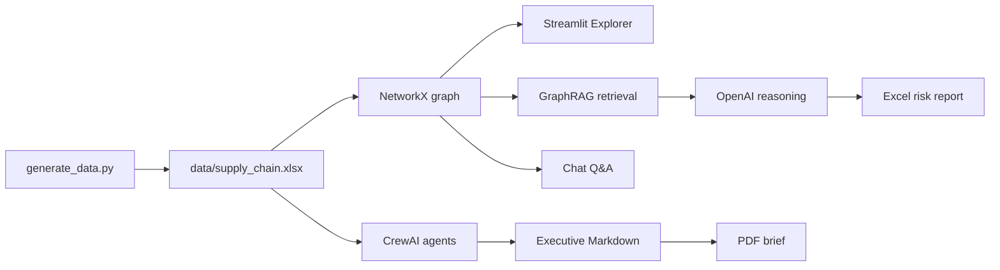

# GraphRAG Supply Chain Intelligence Hub

> **Turn a spreadsheet-shaped supply chain into a living risk map.**

GraphRAG Supply Chain Intelligence Hub is a Streamlit workspace for exploring supplier, shipment, warehouse, route, incident, inventory, and contract relationships. It combines a NetworkX knowledge graph with localized retrieval, OpenAI reasoning, CrewAI multi-agent analysis, and executive report generation.

The project is deliberately approachable: the demo dataset is generated locally, the graph is inspectable, and every expensive AI step is an explicit command.

## What is inside

| Surface | What it does |
| --- | --- |
| **Network Explorer** | Browse every workbook sheet and explore an interactive PyVis network of suppliers, shipments, warehouses, incidents, and routes. |
| **GraphRAG Analysis** | Retrieves each supplier's one- and two-hop neighborhood, adds PageRank centrality, and exports a styled Excel risk report. |
| **Graph Chat Q&A** | Matches entities in a question, expands their graph neighborhood, and asks an OpenAI model to answer from that localized context. |
| **CrewAI Workflow** | Runs logistics, financial-risk, and executive-strategy agents sequentially over the expanded dataset. |
| **PDF Generator** | Turns the CrewAI summary, inventory levels, and incident log into an executive PDF brief. |

## The signal path



## Quick start

### 1. Create an environment

```powershell
python -m venv .venv
.\.venv\Scripts\Activate.ps1
python -m pip install --upgrade pip
pip install -r requirements.txt
```

On macOS/Linux, activate with `source .venv/bin/activate`.

### 2. Generate the local dataset

```powershell
python generate_data.py
```

This creates `data/supply_chain.xlsx` with six sheets:

- `Suppliers`
- `Shipments`
- `Incidents`
- `InventoryLevels`
- `TransportRoutes`
- `ContractTerms`

### 3. Launch the hub

```powershell
streamlit run app.py
```

Use the sidebar to open **Network Explorer**, **GraphRAG Analysis**, or **Graph Chat Q&A**.

## AI-enabled workflows

Copy `.env.example` to `.env` and set an API key before running AI features:

```dotenv
OPENAI_API_KEY=your_openai_api_key_here
OPENAI_MODEL=gpt-4o-mini
```

The current scripts use `gpt-4o-mini` directly. `OPENAI_MODEL` is retained as a convenient configuration reference for future model wiring.

Generate the supplier-level GraphRAG assessment:

```powershell
python analytics_engine.py
```

Run the original GraphRAG pipeline instead:

```powershell
python graph_rag.py
```

Run the three-agent executive workflow, then build its PDF brief:

```powershell
python crewai_workflow.py
python pdf_generator.py
```

These commands may incur model usage costs. They also expect the generated workbook to exist first. The Streamlit pages can still be used for data exploration without an API key, provided the workbook has been generated.

## Output map

| Output | Created by | Used by |
| --- | --- | --- |
| `data/supply_chain.xlsx` | `generate_data.py` | All graph and reporting flows |
| `data/risk_analysis_output.xlsx` | `analytics_engine.py` or `graph_rag.py` | GraphRAG Analysis page |
| `data/network_graph.html` | Network Explorer page | Embedded interactive graph |
| `data/crewai_executive_report.md` | `crewai_workflow.py` | `pdf_generator.py` |
| `data/Executive_Supply_Chain_Report.pdf` | `pdf_generator.py` | Executive briefing |

Generated artifacts are useful locally, but they are ignored by Git and can be regenerated at any time with the commands above.

## Project layout

```text
.
├── app.py                    # Streamlit home page
├── pages/                    # Streamlit multipage experience
├── generate_data.py          # Reproducible demo workbook generator
├── analytics_engine.py       # PageRank + GraphRAG + styled Excel export
├── graph_rag.py              # Baseline supplier GraphRAG pipeline
├── crewai_workflow.py        # Sequential multi-agent analysis
├── pdf_generator.py          # Executive PDF renderer
├── requirements.txt
└── data/                     # Generated workbook and reports
```

## Engineering notes

- The graph is currently an undirected NetworkX graph. Edge attributes preserve the business relationship, such as `SUPPLIES_SHIPMENT`, `DELIVERED_TO`, and `HAS_INCIDENT`.
- Retrieval is local and intentionally transparent: supplier analysis expands to two hops; chat expands matched entities to one-hop neighbors.
- The demo data is synthetic. Do not place real supplier contacts, commercial terms, or incident details in a public repository.
- AI responses are analytical suggestions, not an automated source of truth. Validate findings against operational systems before acting.
- CI performs offline checks only. It does not call OpenAI or run CrewAI agents.

## Continuous integration

`.github/workflows/ci.yml` runs on pushes and pull requests. It installs the declared dependencies, regenerates the workbook, compiles the Python sources, and verifies the expected workbook sheets and row counts. This keeps the deterministic part of the demo healthy without requiring secrets.

## License

No license has been declared yet. Add one before distributing this project outside its intended workspace.
